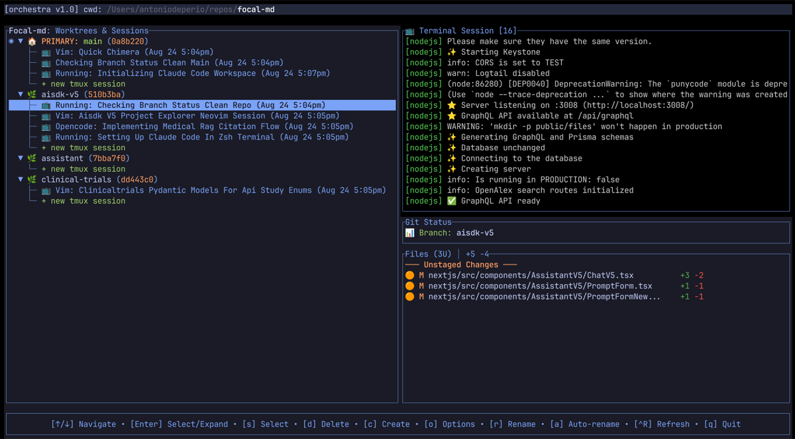

# 🎼 Orchestra

**Orchestra** is a fast, terminal-first TUI application for managing your **Git worktrees** and **tmux sessions** — built for AI coders working with parallel tasks and coding agents like [Claude Code](https://claude.ai), [Opencode](https://opencode.ai), and [Codex](https://openai.com/blog/openai-codex).

Multiple branches, multiple sessions, all in harmony — so you can stay focused on building.



## 🚀 Why Orchestra?

Modern AI development often means juggling **several branches, experiments, and agents at once**.  
Doing this manually with `git worktree` and `tmux` is possible, but Orchestra wraps this up in a nice workflow.  

Orchestra is **terminal-first** and solves this by:
- **Terminal-native experience** — built for developers who live in the terminal.
- **Managing Git worktrees** — spin up clean, isolated worktrees for new features, experiments, or agent tasks.  
- **Integrating with tmux** — map worktrees to tmux sessions for true parallelism in your terminal.  
- **Keyboard-driven, Vim-friendly interface** — every action is designed for speed and minimal keystrokes.  
- **Easy switching between sessions** — Orchestra attaches directly into tmux, so you can use familiar shortcuts like `Ctrl-b d` to detach and move around.  
- **AI-first workflows** — optimized for terminal coders using Claude Code, Opencode, Goose CLI, Vim, Helix, etc.  
- **Blazing fast** — written in Rust for performance and reliability.  

## ✨ Features

- 🎯 Manage **Git worktrees** without memorizing complex commands  
- 🖥️ One-key **tmux session launch** for each worktree  
- ⌨️ **Keyboard-driven, Vim-friendly** navigation for maximum speed  
- 🔄 Quick switching between multiple AI coding tasks in progress  
- 📂 Automatic branch/session alignment: each branch maps to its own tmux world  
- ⚡ **Native Performance** - Compiled Rust TUI with <100ms startup
- 🤖 **AI-Powered Sessions** - Intelligent session naming with context detection
- 🌳 **Hierarchical Navigation** - Tree view of worktrees with expandable sessions
- ⚡ **Real-time Updates** - Live git status, session previews, auto-refresh
- 🛠️ Minimal setup — works with your existing Git + tmux setup  
- 🧑‍💻 Compatible with **any terminal coder** — Claude Code, Opencode, Goose CLI, Vim, Emacs, Helix, or your favorite editor  
- 🔀 Works seamlessly with **standard tmux shortcuts** (`Ctrl-b d` to detach, `Ctrl-b n/p` to cycle, etc.)  
- 🤖 **Background AI workflows** — start an AI agent in one session, detach, and let it run while you switch back to coding in another

## 📦 Installation

### Homebrew (macOS & Linuxbrew)
On macOS and Linux (with [Linuxbrew](https://docs.brew.sh/Homebrew-on-Linux)):

```bash
brew tap humanunsupervised/orchestra
brew install orchestra
```

### npm (Node.js)
Install globally via npm on any platform with Node.js installed:

```bash
npm install -g @humanu/orchestra
```

## 🎹 Usage

Simply run Orchestra inside a Git repository:

```bash
orchestra
```

From there, the **TUI takes over**:
- Browse existing branches and worktrees  
- Create new worktrees with a few keystrokes  
- Launch and attach tmux sessions automatically  
- Switch between active sessions instantly  
- Navigate everything with **fast, keyboard-driven controls**  
- Use all your **normal tmux shortcuts** (`Ctrl-b d` to detach, `Ctrl-b n/p` to cycle, etc.) — Orchestra doesn't break your flow  

### TUI Interface

The main interface provides:
- **Visual Navigation**: Hierarchical tree view of worktrees and sessions
- **AI Session Management**: Auto-rename sessions with context detection
- **Real-time Updates**: Live git status and session previews
- **One-key Operations**: Create, delete, switch with single keystrokes

**Key Controls:**
- `↑/↓` Navigate • `Enter` Select/Expand • `d` Delete • `c` Create • `q` Quit

Because Orchestra runs inside tmux, you can:
- Run your **app/server** in one session  
- Keep your **editor (Vim, Helix, Emacs, etc.)** open in another  
- Run **AI coders** like Claude Code, Opencode, or Goose CLI — each isolated to its own worktree/session  
- **Start an AI agent on a task, detach, and let it run in the background** while you continue working elsewhere  
- All in parallel, sandboxed, without window/tab juggling

## ⚙️ How It Works

At its core, Orchestra combines **Git worktrees** and **tmux sessions** into a single workflow:

- Each **Git worktree** represents a branch, isolated environment, or experiment.  
- Each worktree maps to its own **tmux session**, giving you a clean, sandboxed workspace.  
- The **TUI** handles orchestration — spin up, switch, or destroy environments with just a few keys.  
- Since Orchestra rides on top of tmux, you still have full access to all **standard tmux keybindings** you already know.  
- You can **leave long-running processes running in the background** — for example, start an AI coding agent in one session, detach, and switch back to another without interrupting it.  
- This means you can manage multiple parallel coding sessions, each fully isolated at the Git and tmux level, without clutter or context loss.  

## 🧱 Why Git Worktrees + tmux?

We chose **Git worktrees** and **tmux** as the foundation for Orchestra because they're:

- ✅ **Proven** — decades of real-world use, trusted by Linux power users everywhere  
- ✅ **Battle-tested** — work reliably under heavy parallel workloads  
- ✅ **Widely supported** — available on macOS, Linux, and most developer environments out-of-the-box  
- ✅ **Composable** — play nicely with existing CLI tools, shells, and workflows  
- ✅ **Lightweight** — no vendor lock-in, no heavy dependencies, no hidden magic  

And since Orchestra builds on **tmux**, you can use **any terminal-based coding tool** inside your sessions:  
Claude Code, Opencode, Goose CLI, Vim, Emacs, Helix — whatever fits your flow.  

## 🔧 Requirements

- **Git 2.5+** (for `git worktree` support)
- **tmux** (for session management)
- **bash** (shell integration)
- **jq** (JSON processing)

## 🚀 Workflow

1. **Launch TUI** (`orchestra`) from any git repository
2. **Navigate visually** through worktrees and sessions
3. **Create sessions** - Automatically marked for AI naming
4. **Work & detach** - Normal tmux workflow (Ctrl+B, D)
5. **Return to TUI** - Sessions intelligently renamed with context

## 📜 License

Proprietary License. Free for personal and commercial use. See [LICENSE](LICENSE) for details.

## 🤝 Support

For issues and feature requests, please create an issue in this repository.

---

**Built with ❤️ using Rust + ratatui for modern terminal experiences.**

